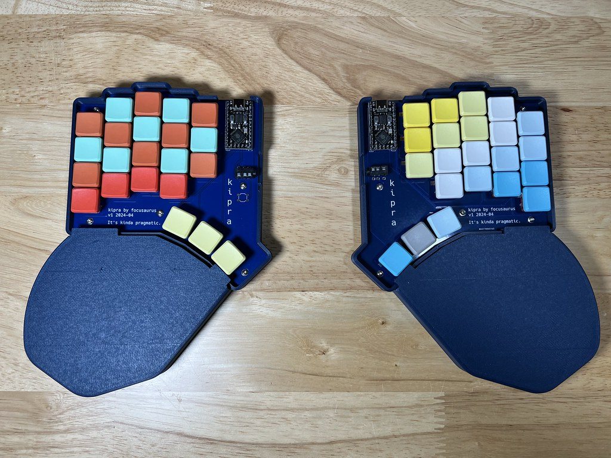

# kipra: It's kinda pragmatic.

A split ergonomic mechanical keyboard built with ergogen, kicad, and freecad.

There's a [blog post with details on this build](https://peterlyons.com/problog/2024/05/kipra-keyboard/) on my blog.

## What's in this repository

- The ergogen file at `v1/kipra-v1.ergogen.yaml`
- FreeCAD files for the case, palm rest, and various jigs and smaller parts
- The kicad PCB project files which were generated initially with ergogen then edited in kicad to route the tracks, add silkscreen, etc.
- Some reference pinout images for the RP2040 MCU I used
- a few screenshots from along the way
- a zip of the gerber files I sent to PCBWay if you just want to order PCBs

# Notes to self

## How to make the test print

- use ergogen via `./bin/build.sh` to output `v1/build/outlines/test_print.dxf`
- In freecad, start a new file and use Draft workbench
- Import the .dxf file. It will create many shapes.
- Select them all and hit the blue up arrow to upgrade them to wires
- Select them all and click the squiggly icon to convert to sketch
- Switch to Part Design Workbench
- Make a new body
- put the sketch in the body
- select the sketch and pad up 6mm

# MCU pinout on RP2040 (compatible)

| Pin | Use   | (center) | Use        | Pin |
| --- | ----- | -------- | ---------- | --- |
|     |       |          | Col Thumb  | P19 |
|     |       |          | col inner  | P18 |
| P6  | row 4 |          | col index  | P15 |
| P7  | row 3 |          | col middle | P15 |
| P8  | row 2 |          | col ring   | P16 |
| P9  | row 1 |          | col pinky  | P10 |

# v1 Solder Jumpers

TL;DR this is very confusing because reversible/symmetric PCBs are confusing.

With your PCBs laid out left & right as they will be when the keyboard is built and in use - top side facing up, you solder **ALL 4 COLUMNS OF JUMPERS ON THE PCB TOP SIDES**. None of the jumpers on the bottom side of the PCBs get soldered.

The left and right PCBs are symmetric, but the left and right MCUs are NOT. So to account for that we have do factor that into our pinouts and jumper routing.

Info for reference:

- In kipra v1, the footprint used was: [nice_nano.js from commit 753a](https://github.com/ceoloide/ergogen-footprints/blob/753a3464b552da21bd121a076ddfa4b47fadcfe8/nice_nano.js) in github.com/ceoloide/ergogen-footprints.
- This version did not yet support the `reverse_mount` parameter. If kipra v2 becomes a thing, we'll do that.
- However, the nice_nano footprint is design with the following configuration in mind (which we do NOT want to use in the kipra):
  - you want to mount your MCUs face down (Dunno, many folks like this?)
  - you want the jumper solders on the back so they are out of sight and don't obscure the silkscreen for the MCU pinout labels
- BUT in the case of the kipra v1, I specifically want to mount my MCUs face up because they have on-board reset buttons so flashing them is easy and I don't need a reset button on the main keyboard PCB. I added support for one just in case anyway, but hope to not have to use it. In general, I want to support the trend of the hobbyist MCUs having conveniences built-in so the barrier to build a custom keyboard is lower, and every little bit helps.

## How to: model the case in FreeCad

- start a new file
- switch to the Draft workbench
- import `v1/build/outlines/plate-shape.dxf`
- select all the shapes in the tree view
- click "Upgrade" blue up arrow to get a wire
- click the wire and click the squiggly "convert birectionally from draft to sketch"
- switch to the Part workbench
- select the sketch and select the 2D offset (hidden behind an arrow next to 3D offset)
- set distance to 2.6mm (2.4 for the wall and 0.2 for fit)
  - set the join type to tangent!
- click fill offset
- select the 2D offset in the tree view and click extrude to 10mm

## How to: model the case in FreeCAD (prototype 6)
- start a new file
- switch to the Draft workbench
- import `v1/build/outlines/plate-shape.dxf`
- select all the shapes in the tree view
- click "Upgrade" blue up arrow to get a wire
- click "Upgrade" blue up arrow again to get a face
- Use the offset 2D tool to get an offset 2.4mm from the edge of the face
  - set the join type to tangent!
- extrude that offset up 12mm and click to make a solid
- click the wire and click the squiggly "convert birectionally from draft to sketch"
  - this gives us the outer wall
- extrude the face for the bottow up 2mm
- this is all not exactly right but I was experimenting too quickly to keep track of it
